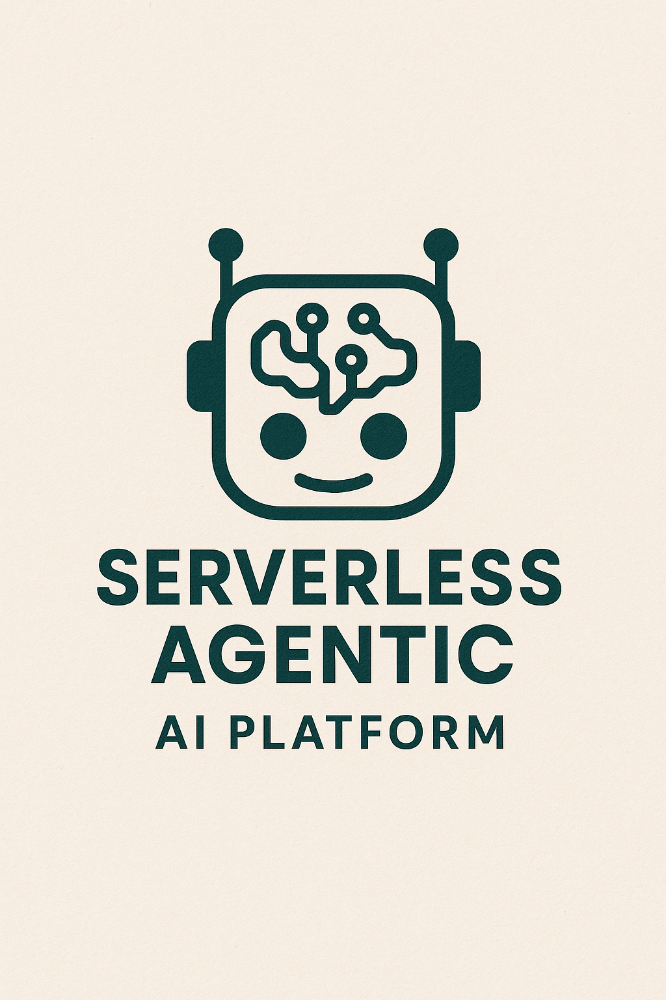

# Serverless Agentic AI Platform on AWS


Most of this code is generated using Vibe Coding.
#### **Model:** Claude
#### **URL:** https://claude.ai/

#### **Version:** 3.7 Sonnet
#### **Prompt:**
```
I'm building a serverless Agentic AI platform on AWS Lambda for Re-act agents in python. I want the code to be minified (less lines). 
 1. Implementation plan for each layer:
   - Core dependencies layer with specific libraries and their purposes (langchain, boto3 etc as needed)
   - AWS service abstraction layer with patterns for common operations (authentication, queueing, storage, database operations etc)
   - Protocol & Client Interfaces layer with:
     a. Agent-to-Agent (A2A) Protocol:
        - Agent Card specification
        - Discovery mechanism
        - Communication patterns
     b. Model Context Protocol (MCP) Client:
        - Given a URL of an MCP server, bring the capabilities of the MCP server to the agent to use.
 2. Lambda function implementations:
   - Re-act loop pattern
   - Tool selection and integration approach
   - Agent reasoning implementation
   - Cross-agent coordination
   - MCP server interactions
```
This prompt generated 7 python files. I picked the following 4 out of 7 files it generated which had some tests, task implementation deployment cdk file etc. Will decide if i need those later.

```
core_dependencies.py   --> This is the base which has all the relevant python pacakges imported (langchain etc)
aws_service_layer.py   --> This abstracts calls to aws services. This gives a flexibility of only changing this if you want to deploy this to another CSP like GCP or Azure
protocol_interfaces.py --> This implements the A2A 
react_agent_lambda.py  --> This implements the actual base level Reason-Act agent. 
```
